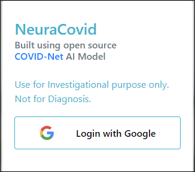
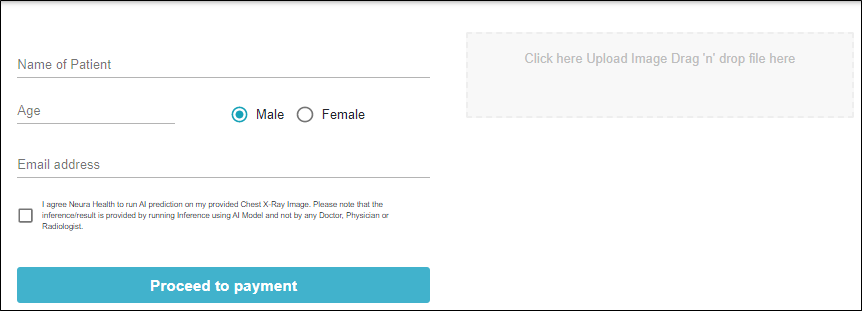
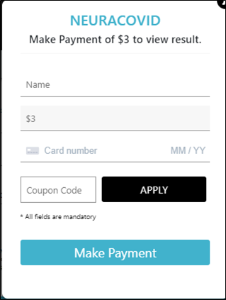
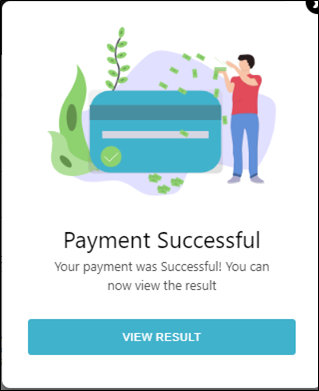
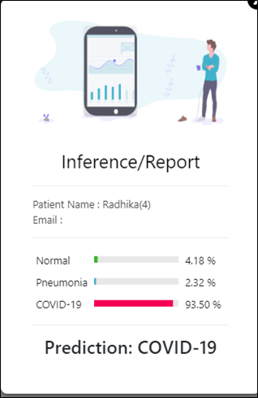
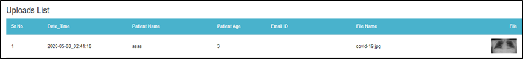
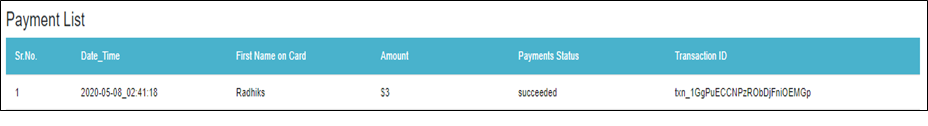
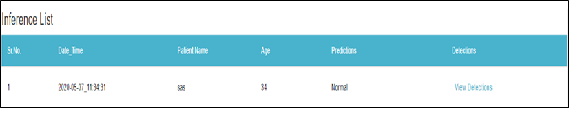
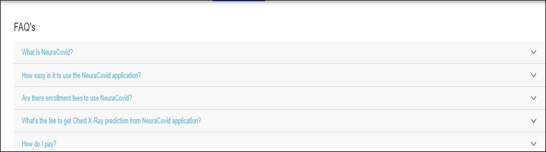
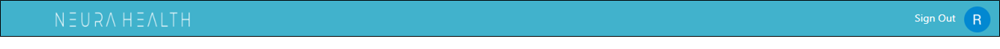

# This readme covers all requirements and dependencies from scratch for Neuracovid application

The NeuraCovid is a web application used to detect COVID-19 from chest X-ray images. This web application is used to increase productivity for Health Professionals and reduce time and cost for the patients. By using Neuracovid, the user will be able to detect AI prediction from the Chest X-ray image. The prediction results could be across three possibilities: Normal, Pneumonia or COVID-19.

### This Application uses following technologies:

* Firebase Tools (Firestore database, Storage, Google Authentication, Hosting, Functions, database security, storage security)
* React (create-react-app, react-router-dom)
* Serverless NodeJs Functions (using Firebase Functions)
* Stripe APIs for Payment
* Async/Await 

## Prerequisites 

* Install [Node.js version 8 or greater][node] 
*	Download latest version of git for the system from https://git-scm.com/downloads 
*	Create a new firebase project, go to your  [Firebase console](https://console.firebase.google.com), click “Add Project”, type in your project’s name and select your region and activate the Blaze plan for the project. 
* Create pubsub topics on Google Cloud Platform, go to [Google Cloud Platform](https://console.cloud.google.com), here you can find your created Firebase project. Click on Topics, create a new topic. For more details please refer link https://cloud.google.com/pubsub/docs/admin

## Follow the below steps to run NeuraCovid Application
### Step 1 
Clone the repository with the following command \
**git clone** https://github.com/neurahealth/neuracovid.git \
You must use following command for changing directory to repository \
**cd neuracovid** 
### Step 2
For installing required dependencies in the local machine use following command \
**npm install** 
### Step 3
You will need a Stripe account in order to make payment in Application. Once you set up your account, go to the Stripe [developer dashboard](https://dashboard.stripe.com/dashboard) to find your API keys.\
**[APIkeys]https://stripe.com/docs/development#api-keys.** \
Set stripe **secret key** to the functions config \
**Firebase functions:config:set stripe.secret="Your_Stripe_Secret_Key"**\
Also set stripe **publishable key**  in Payment Model.
### Step 4
 Then enter your Firebase app credentials into **config/constants.js** you will find these credentials in your Firebase console and click Project Overview in the top left then click Add Firebase to your web app.\
 **cd function && npm install** 

### Step 5
To run the application and to set your default browser and then front-end being served from `https://localhost:3000/'. For this use following command \
**yarn start or npm start**
 
## How NeuraCovid Works

Users can login via his/ her Google account. After successful login users need to add some patient info and upload chest x-ray images in the form of jpeg and make payment then the user will get the result of Covid-19. After successful transaction users will log out from the system.

 
## How NeuraCovid Works YouTube video link 
https://www.youtube.com/watch?v=9erwBwCPPzU&feature=emb_title

## Sample Application Screens
**1)Login:** To login the user is required to enter valid credentials. The successful login will display the home page.

**2)Home:** After a successful login, the Home page will be displayed that will be used to upload patient details and upload a chest x-ray image

**3)Make Payment:** After a successful uploading patients data, then click on  ‘Proceed To Payment’ button, Payment window will be as 

**4)Payment Successful:** As the user enters all required details the message box will be populated with text “Payment Successful”

**5)View Result:** After successful payment is done and clicks on ‘View Report’, the patient report will be display

**6)Uploads:** The upload tab contains the information which user already  added at the time of upload patient details

**7)Payments:** The payment tab contains the information which user already added at the time of make payment

**8)Inferences:** The Inferences tab contains the information which user already added by user and results

**9)FAQ:** Users can view the list of FAQ by clicking on the ‘FAQ’s’ button

**10)SignOut:** There will be logout functionality available in the application by using this user log out from the system and session    will expire

## Application Deployment Steps

To deploy and Host application with firebase you will need to perform following steps.

### 1. Install Firebase Tools 
You can install the tools by running the following command: \
**npm install firebase-tools -g** 

### 2. Login to Firebase 
You will now need to login to Firebase from your terminal. \
**firebase login**

### 3. Initialize Firebase in Your React App
Now that you’re logged in, you will need to initialize Firebase in your React app. Run the following command:\
**firebase init**

You will then be prompted with a series of questions and configuration options are given below\
3.1. Select Hosting: Configure and deploy Firebase Hosting sites.\
3.2. Select Use an existing project\
3.3. Select your Firebase Project (e.g. Your firebase project name)

### 4. Deploying Your App
Now that everything is set up, you can go ahead and deploy your app! All you need to do now is run:\
**firebase deploy**\
Firebase will then give you a unique URL where your deployed app is located. For example, it might look similar to:\
https://example.firebaseapp.com \
**For more details you can refer the link:**\
https://medium.com/swlh/how-to-deploy-a-react-app-with-firebase-hosting-98063c5bf425)
 
**All Set. Cheers!**

